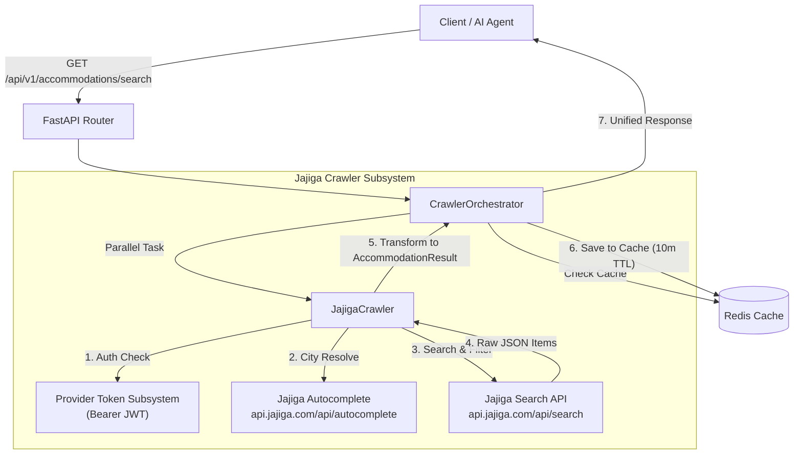

# Jajiga Provider Documentation & AI Agent Integration Guide

This document provides a comprehensive guide for integrating and querying the **Jajiga (جاجیگا)** accommodation crawler within the Safarchin Travel Crawler API.

---

## 📌 1. Provider Overview

| Attribute | Specification |
| :--- | :--- |
| **Provider Name** | `jajiga` |
| **Category** | Accommodations, Villas, Cottages, Suites, Rural Homes |
| **Target Website** | [https://www.jajiga.com](https://www.jajiga.com) |
| **Backend API** | `https://api.jajiga.com/api` |
| **Image CDN** | `https://storage.jajiga.com/public/pictures/medium/{image_path}` |
| **Default Currency** | Toman (IRT) |
| **Authentication** | Bearer JWT (RS256) |
| **Current Token Expiration** | **October 2027** (`exp: 1819632029`) |

---

## 🏗️ 2. Architecture & Data Flow



1. **City Resolution**: Accepts Persian or English names (e.g. `"سوادکوه"`, `"Savadkuh"`). Pre-maps known destination IDs (e.g. Savadkuh is `305`, Ramsar is `201`) and dynamically resolves unmapped locations using Jajiga's autocomplete endpoint.
2. **Date Normalization**: Converts Jalali dates (e.g. `1405-07-24`) to Gregorian (`2026-10-15`) on the fly.
3. **Resilient HTTP**: Emulates modern Chrome TLS fingerprints via `curl_cffi` to prevent bot blocks.
4. **Token Injection**: Automatically injects the active Bearer JWT token if configured via CLI or `.env`.

---

## 🎛️ 3. Input Search Filters

The search endpoint `GET /api/v1/accommodations/search` accepts the following query parameters:

### Core Parameters
| Parameter | Type | Required | Default | Description & Examples |
| :--- | :--- | :---: | :---: | :--- |
| `city` | `string` | **Yes** | - | Destination city, town, or region. Examples: `سوادکوه`, `Savadkuh`, `رامسر`, `Ramsar`, `کیش`, `تهران`. |
| `checkin_date` | `string` | **Yes** | - | Check-in date. Supports Gregorian (`2026-10-15`) or Jalali (`1405-07-24`). |
| `checkout_date` | `string` | **Yes** | - | Check-out date. Supports Gregorian (`2026-10-18`) or Jalali (`1405-07-27`). |
| `guests` | `integer` | No | `2` | Minimum guest capacity (1 to 50). |
| `providers` | `string` | No | all | Comma-separated providers to query, e.g. `jajiga` or `jajiga,karnaval`. |
| `no_cache` | `boolean` | No | `false` | Set `true` to bypass Redis cache and force real-time crawl. |

### Property Type Filter (`property_type`)
Filters listings by residence type:
- `villa` (ویلا)
- `cottage` (کلبه)
- `swiss_cottage` (کلبه سوئیسی)
- `wooden_cottage` (کلبه چوبی)
- `apartment` (آپارتمان)
- `suite` (سوئیت)
- `ruralhome` (خانه روستایی)
- `ecolog` (اقامتگاه بوم‌گردی)
- `apartmenthotel` (هتل آپارتمان)
- `motel` (متل)

### Price Range Filters
- `min_price`: Minimum price per night in Tomans (e.g. `1000000` for 1,000,000 Tomans).
- `max_price`: Maximum price per night in Tomans (e.g. `4500000` for 4,500,000 Tomans).

### Amenities & Facilities (`amenities`)
Comma-separated list of required amenities. Example: `pool,jacuzzi,wifi`:
- **Pools**: `pool` (all pools), `pool-outdoor` (استخر روباز), `pool-indoor` (استخر سرپوشیده), `pool-hot` (استخر آبگرم)
- **Entertainment**: `jacuzzi` (جکوزی), `sauna` (سونا), `billiard` (میز بیلیارد), `foosball` (فوتبال دستی)
- **Comfort**: `parking` (پارکینگ), `heating` (گرمایشی), `cooler` (سرمایشی/اسپلیت), `wifi` (اینترنت وای‌فای), `elevator` (آسانسور), `furniture` (مبلمان)

### Sorting (`sort_by`)
- `popularity` (محبوب‌ترین - Default)
- `low_price` (ارزان‌ترین قیمت)
- `high_price` (گران‌ترین قیمت)
- `rating` (بالاترین امتیاز مسافران)
- `newest` (جدیدترین اقامتگاه‌ها)
- `books` (بیشترین رزروهای موفق)
- `discount` (اقامتگاه‌های تخفیف‌دار)

### Pagination (`page`)
- `page`: Page index (starts at `1`). Each page contains up to 18 units.
- Responses contain a structured `pagination` object with `current_page`, `per_page`, `total_count`, `total_pages`, `has_next_page`, and `has_prev_page`.

---

## 🗺️ 4. Location Discovery API (Provinces & Cities)

To allow users and AI agents to discover supported regions dynamically without guessing names:

### 1. List Provinces
`GET /api/v1/accommodations/provinces?provider=jajiga`
- **Query Params**:
  - `provider` (optional, default `jajiga`): Target provider name.
  - `no_cache` (optional, default `false`): Bypass 24h Redis cache.
- **Response**:
```json
{
  "status": "success",
  "provider": "jajiga",
  "total": 39,
  "provinces": [
    {
      "id": "p24",
      "slug": "gilan",
      "name": "گیلان",
      "rooms_count": 7748
    },
    {
      "id": "p26",
      "slug": "mazandaran",
      "name": "مازندران",
      "rooms_count": 7416
    }
  ]
}
```

### 2. List Cities & Districts
`GET /api/v1/accommodations/cities?provider=jajiga&province_id=p26`
- **Query Params**:
  - `provider` (optional, default `jajiga`): Target provider name.
  - `province_id` (optional): Parent province ID (e.g. `p24` for Gilan, `p26` for Mazandaran).
  - `no_cache` (optional, default `false`): Bypass 24h Redis cache.
- **Response**:
```json
{
  "status": "success",
  "provider": "jajiga",
  "province_id": "p26",
  "total": 66,
  "cities": [
    {
      "id": "305",
      "slug": "savadkuh",
      "name": "سوادکوه",
      "province_id": "p26",
      "rooms_count": null
    },
    {
      "id": "201",
      "slug": "ramsar",
      "name": "رامسر",
      "province_id": "p26",
      "rooms_count": null
    }
  ]
}
```

---

## 🔑 5. Multi-Token Pool & 429 Auto-Rotation (`app/cli.py`)

To prevent **HTTP 429 Too Many Requests**, Safarchin maintains a **multi-token pool** per provider with automatic failover, cooldown tracking (5 minutes), and round-robin token selection.

### Add Multiple Tokens to the Pool
```bash
# Add token 1
docker compose run --rm web python -m app.cli providers token add \
    --provider jajiga \
    --token "Bearer eyJ0eXAi..." \
    --expires-at "2027-10-01T00:00:00Z"

# Add token 2 (spare/failover token)
docker compose run --rm web python -m app.cli providers token add \
    --provider jajiga \
    --token "Bearer eyJhbGc..." \
    --expires-at "2027-10-01T00:00:00Z"
```

### Inspect Token Pool & Cooldowns
```bash
docker compose run --rm web python -m app.cli providers token list
```

### Manually Advance / Rotate Token
```bash
docker compose run --rm web python -m app.cli providers token rotate --provider jajiga --reason "manual_rotation"
```

### Remove a Token from the Pool
```bash
docker compose run --rm web python -m app.cli providers token remove --provider jajiga --token-id tok_2
```

### Automatic 429 Behavior
When Jajiga returns HTTP 429:
1. The active token is marked as `COOLDOWN` for 300 seconds.
2. The crawler switches immediately to the next available token in the pool.
3. The failed request is retried transparently up to 4 times.

---

## 🤖 6. AI Agent Function / Tool Definition

When exposing this crawler to an LLM / AI agent (OpenAI Tools, Anthropic Tool Use, or Gemini Function Calling), provide the following JSON schema:

```json
{
  "name": "search_accommodations",
  "description": "Search and aggregate villas, cottages, suites, and rural homes across Iran (Jajiga, etc.) with real-time pricing, availability, and pagination.",
  "parameters": {
    "type": "object",
    "properties": {
      "city": {
        "type": "string",
        "description": "Destination city or region name in Persian or English (e.g. 'سوادکوه', 'Savadkuh', 'رامسر', 'Ramsar', 'تهران', 'کیش')"
      },
      "checkin_date": {
        "type": "string",
        "description": "Check-in date in YYYY-MM-DD (Gregorian) or 1405-07-24 (Jalali)"
      },
      "checkout_date": {
        "type": "string",
        "description": "Check-out date in YYYY-MM-DD (Gregorian) or 1405-07-26 (Jalali)"
      },
      "guests": {
        "type": "integer",
        "default": 2,
        "description": "Number of guests"
      },
      "property_type": {
        "type": "string",
        "enum": ["villa", "cottage", "swiss_cottage", "wooden_cottage", "apartment", "suite", "ruralhome", "ecolog"],
        "description": "Type of accommodation"
      },
      "min_price": {
        "type": "integer",
        "description": "Minimum price per night in Tomans (IRT)"
      },
      "max_price": {
        "type": "integer",
        "description": "Maximum price per night in Tomans (IRT)"
      },
      "amenities": {
        "type": "string",
        "description": "Comma-separated amenities (e.g. 'pool,jacuzzi,wifi,parking')"
      },
      "sort_by": {
        "type": "string",
        "enum": ["popularity", "low_price", "high_price", "rating", "newest", "discount"],
        "default": "popularity",
        "description": "Sort order of the results"
      },
      "page": {
        "type": "integer",
        "default": 1,
        "description": "Page number for pagination"
      },
      "providers": {
        "type": "string",
        "default": "jajiga",
        "description": "Provider filter (e.g. 'jajiga')"
      }
    },
    "required": ["city", "checkin_date", "checkout_date"]
  }
}
```

---

## 📡 7. Sample API Request & Response

### HTTP Request
```http
GET /api/v1/accommodations/search?city=سوادکوه&checkin_date=2026-10-15&checkout_date=2026-10-18&guests=4&property_type=swiss_cottage&amenities=pool,wifi&sort_by=low_price&page=1&providers=jajiga HTTP/1.1
Host: localhost:8000
X-API-Key: sc_your_api_key_here
```

### cURL Example
```bash
curl -X GET "http://localhost:8000/api/v1/accommodations/search?city=%D8%B3%D9%88%D8%A7%D8%AF%DA%A9%D9%88%D9%87&checkin_date=2026-10-15&checkout_date=2026-10-18&guests=4&property_type=swiss_cottage&amenities=pool,wifi&sort_by=low_price&page=1&providers=jajiga" \
     -H "X-API-Key: sc_your_api_key_here"
```

### JSON Response (with Pagination)
```json
{
  "status": "success",
  "total_results": 1,
  "pagination": {
    "current_page": 1,
    "per_page": 18,
    "total_count": 15,
    "total_pages": 1,
    "has_next_page": false,
    "has_prev_page": false
  },
  "results": [
    {
      "id": "3254790",
      "provider": {
        "name": "jajiga",
        "deep_link": "https://www.jajiga.com/room/3254790",
        "scraped_at": "2026-10-05T12:35:00.123456Z"
      },
      "title": "رزرو کلبه چوبی در سوادکوه - لفور",
      "property_type": "swiss_cottage",
      "city": "سوادکوه",
      "capacity_standard": 4,
      "capacity_max": 8,
      "bedrooms": 2,
      "rating": 4.9,
      "reviews_count": 67,
      "price_per_night": {
        "amount": 2200000.0,
        "currency": "IRT",
        "formatted": "2,200,000 تومان"
      },
      "thumbnail_url": "https://storage.jajiga.com/public/pictures/medium/2025/03/03/3254790250303190701.jpg",
      "amenities": [
        "is_plus",
        "pool",
        "wifi"
      ]
    }
  ]
}
```
