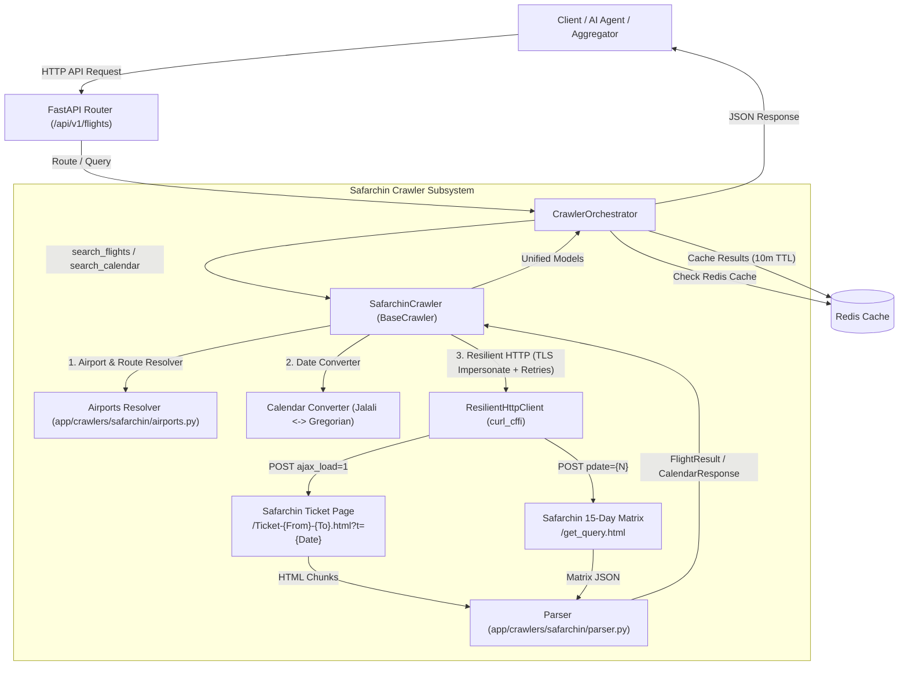

# Safarchin Provider Documentation & Integration Guide

This document provides a comprehensive reference and developer guide for querying and integrating the **Safarchin (سفرچین)** flight and transport crawler within the Safarchin Travel Crawler API.

---

## 📌 1. Provider Overview

| Attribute | Specification |
| :--- | :--- |
| **Provider Name** | `safarchin` |
| **Category** | Domestic & International Flights, 15-Day Low-Price Calendar, Intercity Trains |
| **Target Website** | [http://safarchin.ir](http://safarchin.ir) |
| **Underlying Engine** | Agent724 / Charter724 White-Label Engine |
| **Default Currency** | Iranian Toman (`IRT`) / Iranian Rial (`IRR`) |
| **Scraping Authentication** | None (Publicly accessible endpoints with TLS fingerprinting) |
| **Anti-Bot Resilience** | TLS JA3/JA4 Impersonation (`chrome120`) via `curl_cffi` |
| **Retry Policy** | Automatic 3-stage retry with exponential backoff |

---

## 🏗️ 2. Architecture & Data Flow



---

## 🛫 3. Airport & Route Resolution

Safarchin links routes using internal 5-digit city IDs (`10000`, `10001`, etc.) and English URL slug names (`Tehran`, `Mashhad`, `Kish`, etc.).

The crawler provides an intelligent **Airport Resolver** ([`app/crawlers/safarchin/airports.py`](file:///Users/david/Documents/projects/sharifi/safarchin_crawler/app/crawlers/safarchin/airports.py)) supporting **177 airports and cities**. Queries accept any of the following input formats:
* **IATA Code (3 Letters):** `THR`, `MHD`, `KIH`, `SYZ`, `TBZ`, `IFN`, `IST`, `DXB`
* **Persian City Name:** `تهران`, `مشهد`, `کیش`, `شیراز`, `تبریز`, `اصفهان`
* **English City Name:** `Tehran`, `Mashhad`, `Kish`, `Shiraz`, `Tabriz`, `Isfahan`
* **5-Digit City ID:** `10000`, `10001`, `10003`, etc.

### Common Route Lookup Table

| IATA Code | City (English) | City (Persian) | Safarchin ID | URL Route Slug |
| :---: | :--- | :--- | :---: | :--- |
| **`THR` / `IKA`** | Tehran / Imam Khomeini | تهران / امام خمینی | `10000` | `Tehran` |
| **`MHD`** | Mashhad | مشهد | `10001` | `Mashhad` |
| **`IFN`** | Isfahan | اصفهان | `10002` | `Isfahan` |
| **`KIH`** | Kish Island | کیش | `10003` | `Kish` |
| **`AWZ`** | Ahwaz | اهواز | `10004` | `Ahwaz` |
| **`SYZ`** | Shiraz | شیراز | `10005` | `Shiraz` |
| **`TBZ`** | Tabriz | تبریز | `10006` | `Tabriz` |
| **`BND`** | Bandar Abbas | بندرعباس | `10010` | `Bandar Abass` |
| **`PGU`** | Asaluyeh | عسلویه | `10009` | `Asalooye` |
| **`GSM`** | Qeshm Island | قشم | `10012` | `Gheshm` |
| **`IST` / `SAW`** | Istanbul | استانبول | `10017` | `Istanbul` |
| **`DXB`** | Dubai | دبی | `10018` | `Dubai` |

---

## 🎛️ 4. Endpoints & API Reference

### 1. Flight Search (`GET /api/v1/flights/search`)

Searches real-time flight offers across Safarchin (or aggregated across all providers).

#### Request Parameters
| Parameter | Type | Required | Default | Description |
| :--- | :--- | :---: | :---: | :--- |
| `origin` | `string` | **Yes** | - | Origin city code, Persian or English name (`THR`, `Tehran`, `تهران`). |
| `destination` | `string` | **Yes** | - | Destination city code, Persian or English name (`MHD`, `Mashhad`, `مشهد`). |
| `depart_date` | `string` | **Yes** | - | Departure date in Gregorian (`YYYY-MM-DD`) or Jalali (`1405-07-14`). |
| `return_date` | `string` | No | `null` | Optional return date for round-trip search. |
| `adults` | `integer` | No | `1` | Number of adult passengers (`1` to `9`). |
| `providers` | `string` | No | all | Pass `safarchin` to query only Safarchin, or omit to aggregate. |
| `no_cache` | `boolean` | No | `false` | Set `true` to force fresh live scrape bypassing Redis cache. |

#### Example Request
```bash
curl -X GET "http://localhost:8000/api/v1/flights/search?origin=THR&destination=MHD&depart_date=1405-07-14&providers=safarchin" \
     -H "X-API-Key: <YOUR_API_KEY>"
```

#### Example Response
```json
{
  "status": "success",
  "total_results": 25,
  "results": [
    {
      "id": "safarchin_7702_0430_0",
      "provider": {
        "name": "safarchin",
        "deep_link": "http://safarchin.ir/Ticket-Tehran-Mashhad.html?t=1405-07-14",
        "scraped_at": "2026-10-05T13:15:48.705974"
      },
      "is_charter": true,
      "price": {
        "amount": 9312300.0,
        "currency": "IRT",
        "formatted": "9,312,300 تومان"
      },
      "available_seats": 9,
      "outbound": [
        {
          "airline_name": "آوا ایر",
          "airline_code": null,
          "flight_number": "7702",
          "aircraft": "بوئینگ",
          "origin_code": "THR",
          "destination_code": "MHD",
          "departure_time": "04:30",
          "arrival_time": "06:00",
          "departure_date": "2026-10-06",
          "arrival_date": "2026-10-06",
          "cabin_class": "economy",
          "baggage": "20 KG"
        }
      ],
      "inbound": null
    }
  ]
}
```

---

### 2. 15-Day Low-Price Calendar (`GET /api/v1/flights/calendar`)

Queries the lowest ticket price for each day over a 15-day rolling window. Ideal for fare matrixes and price trend charts.

#### Request Parameters
| Parameter | Type | Required | Default | Description |
| :--- | :--- | :---: | :---: | :--- |
| `origin` | `string` | **Yes** | - | Origin city code or name (`THR`, `Tehran`, `تهران`). |
| `destination` | `string` | **Yes** | - | Destination city code or name (`KIH`, `Kish`, `کیش`). |
| `page` | `integer` | No | `0` | **Pagination offset:** `0` for days 1–15, `1` for days 16–30, `2` for days 31–45. |

#### Example Request
```bash
curl -X GET "http://localhost:8000/api/v1/flights/calendar?origin=THR&destination=KIH&page=0" \
     -H "X-API-Key: <YOUR_API_KEY>"
```

#### Example Response
```json
{
  "status": "success",
  "data": {
    "origin": "Tehran",
    "destination": "Kish",
    "from_title": "تهران",
    "to_title": "کیش",
    "has_next_page": true,
    "next_page": 1,
    "prev_page": -1,
    "calendar": [
      {
        "shamsi_date": "1405-07-14",
        "gregorian_date": "2026-10-06",
        "day_of_week": "سه شنبه",
        "min_price_tomans": 14203000.0,
        "formatted_price": "14,203,000 تومان",
        "is_available": true,
        "booking_link": "http://safarchin.ir/Ticket-Tehran-Kish.html?t=1405-07-14"
      },
      {
        "shamsi_date": "1405-07-15",
        "gregorian_date": "2026-10-07",
        "day_of_week": "چهارشنبه",
        "min_price_tomans": 14203000.0,
        "formatted_price": "14,203,000 تومان",
        "is_available": true,
        "booking_link": "http://safarchin.ir/Ticket-Tehran-Kish.html?t=1405-07-15"
      }
    ]
  }
}
```

---

### 3. Airports Directory (`GET /api/v1/flights/airports`)

Retrieves the dictionary of supported airports and cities with optional fuzzy filtering.

#### Request Parameters
| Parameter | Type | Required | Default | Description |
| :--- | :--- | :---: | :---: | :--- |
| `query` | `string` | No | `null` | Optional search term matching IATA code, English name, or Persian name. |

#### Example Request
```bash
curl -X GET "http://localhost:8000/api/v1/flights/airports?query=Kish" \
     -H "X-API-Key: <YOUR_API_KEY>"
```

#### Example Response
```json
{
  "status": "success",
  "total": 1,
  "airports": [
    {
      "id": "10003",
      "slug": "Kish",
      "iata": "KIH",
      "persian_name": "کیش",
      "english_name": "Kish"
    }
  ]
}
```

---

## 🔄 5. Pagination & Offset Handling

### Calendar Matrix Pagination
The calendar matrix returns 15 days of lowest prices per page:
- **`page=0`**: Days 1 to 15 (Initial search).
- **`page=1`**: Days 16 to 30.
- **`page=2`**: Days 31 to 45.

The response includes navigation flags:
- `has_next_page`: `true` if subsequent dates are available.
- `next_page`: integer offset for the next 15-day chunk.
- `prev_page`: integer offset for the previous 15-day chunk (`-1` if on initial page).

---

## 🛡️ 6. Error Handling & Automatic Retries

1. **Automatic Network Retries**:
   The crawler uses `ResilientHttpClient` configured with `retries=3` and a 15-second timeout. Any transient network drops, HTTP 502/503/504 errors, or connection resets trigger exponential backoff retry attempts (`0.5s`, `1.0s`, `1.5s`).
2. **Sold-Out / Cancelled Flights Handling**:
   Flights flagged with `CLOSE` or `CANCEL` on Safarchin are parsed with `available_seats: 0`, ensuring clients can distinguish active versus sold-out inventory.
3. **Invalid Route Protection**:
   If an origin or destination cannot be resolved, a clear `ValueError` is raised before network transmission, preventing malformed outbound requests.
4. **Graceful Fallbacks**:
   If adult pricing cannot be located in the primary select block, the parser falls back successively to the card display price and the adult price detail tag.

---

## 🧪 7. Automated Testing (TDD)

Run the full Safarchin test suite inside Docker:

```bash
# Run Safarchin crawler unit & integration tests
docker compose exec -T web pytest tests/crawlers/test_safarchin.py -v

# Run with coverage report
docker compose exec -T web pytest --cov=app/crawlers/safarchin tests/crawlers/test_safarchin.py
```
